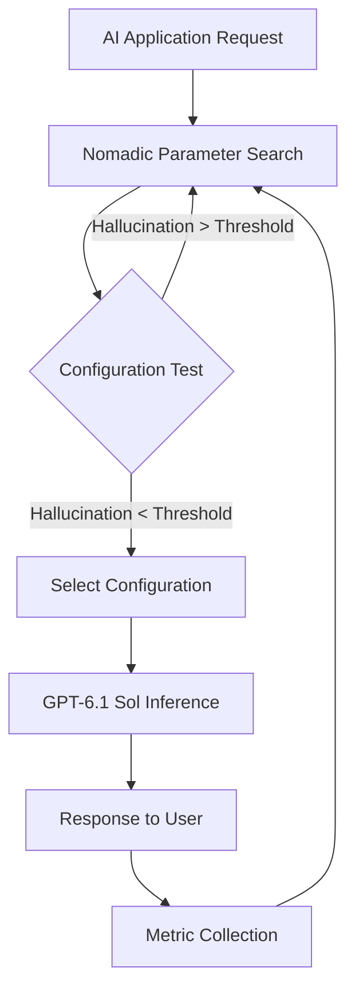
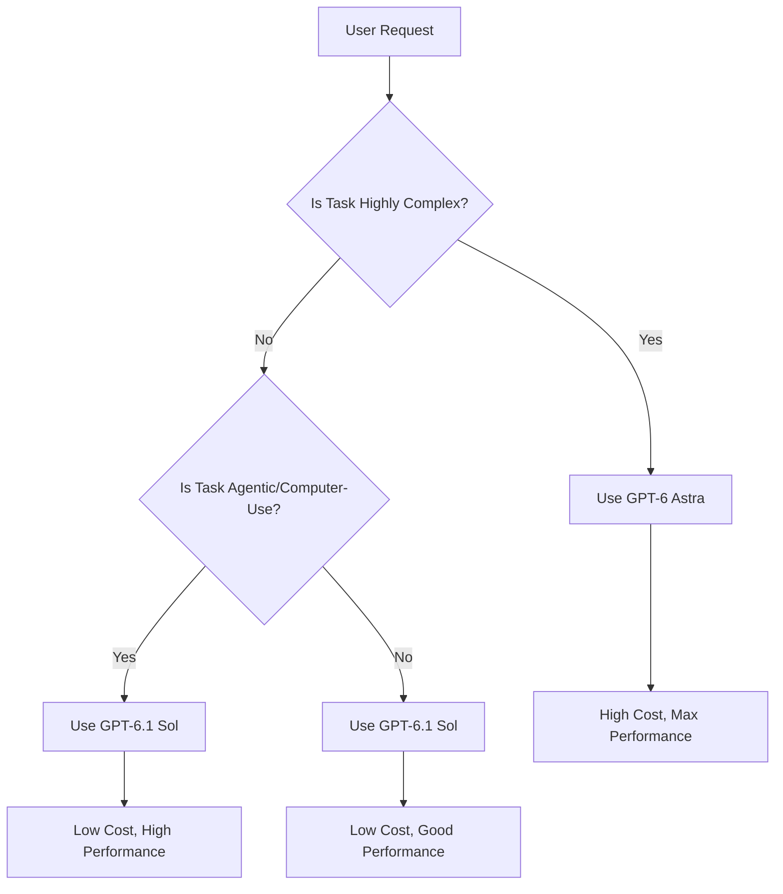

# Inference Costs Plunge: GPT 6.1 Sol Redefines AI Efficiency

*AI landscape reviewed: 2026-09-30*

The release of GPT-6.1 Sol marks a significant inflection point in the economics of AI inference. For software engineers and architects, the primary value proposition is no longer just raw capability, but the ratio of intelligence to cost. GPT-6.1 Sol, which replaced its predecessor GPT-6 Sol just seven days after the initial launch [1], introduces a model tier that delivers performance nearly identical to the flagship GPT-6 Astra at a dramatically lower price point. This shift disrupts the traditional assumption that top-tier reasoning requires top-tier expenditure, forcing a re-evaluation of deployment strategies, budgeting models, and architectural choices for AI-dependent applications.

## Key Takeaways

* **Cost Efficiency:** GPT-6.1 Sol achieves performance within one point of GPT-6 Astra on the Intelligence Index at less than one-quarter of the cost per task [1][1].
* **Rapid Iteration:** The model replaced GPT-6 Sol in only seven days, indicating a compressed cycle for model optimization and release [1].
* **Competitive Advantage:** In specific professional and agentic tasks, GPT-6.1 Sol outperforms competitors like Opus 5.5 at significantly lower costs [2][2].
* **Optimization Tools:** Platforms like Nomadic are emerging to help engineers tune AI systems for maximum efficiency, potentially reducing hallucinations and improving metrics in minutes [3][3].
* **Strategic Shift:** Organizations can now decouple "best performance" from "highest cost," allowing for more flexible and scalable AI deployments.

## What We Know / What We Don't Know

| Aspect | Status | Details |
|:--- |:--- |:--- |
| **Performance vs. Cost** | **Known** | GPT-6.1 Sol scores 1 point below GPT-6 Astra in the Intelligence Index at <25% of the cost [1][1]. |
| **Release Timeline** | **Known** | GPT-6.1 Sol replaced GPT-6 Sol 7 days after its release [1]. |
| **Specific Benchmarks** | **Known** | Data is available for GDP.pdf, AutomationBench, and OSWorld 2.0 [2][2][2]. |
| **Long-term Stability** | **Unknown** | No long-term usage data is available to assess degradation or consistency over months. |
| **Internal Architecture** | **Unknown** | Specific architectural changes between Sol, Astra, and Sol variants are not detailed in the provided sources. |
| **Hardware Requirements** | **Unknown** | Specific hardware optimizations or energy efficiency metrics per token are not provided. |
| **Real-world Latency** | **Unknown** | Latency comparisons under high-load conditions are not specified in the sources. |

## The Rise of Efficient AI: GPT 6.1 Sol's Performance and Cost

The history of large language model (LLM) development has often followed a trajectory of increasing scale to achieve increasing intelligence, with cost scaling accordingly. GPT-6.1 Sol challenges this norm by demonstrating that significant intelligence gains can be achieved without proportional cost increases. The model was introduced as a replacement for GPT-6 Sol, a move executed with remarkable speed—just seven days after the original release [1]. This rapid turnover suggests that the optimization pipeline behind these models has matured, allowing for quick iterations that focus on efficiency and performance tuning.

The core metric driving this discussion is the "Cost per Task." Unlike traditional per-token pricing, which can be misleading for complex reasoning tasks that require multiple steps or tool calls, Cost per Task measures the total expenditure required to achieve a specific outcome. GPT-6.1 Sol scores one point below the flagship GPT-6 Astra on the Intelligence Index, a measure of broad reasoning capability, while costing less than one-quarter as much to complete those tasks [1]. Specifically, at maximum effort settings, the cost difference is stark: $0.72 for GPT-6.1 Sol versus $3.26 for GPT-6 Astra [1].

This does not mean GPT-6 Astra is obsolete. It remains the state-of-the-art benchmark for absolute performance. However, for the vast majority of enterprise applications, the marginal gain of that extra point of intelligence is often not worth the three- to four-fold increase in operational expenditure (OpEx). GPT-6.1 Sol represents a "sweet spot" for production workloads where reliability and cost predictability are paramount.

## GPT 6.1 Sol Outperforms Predecessors at a Fraction of the Cost

To understand the magnitude of this shift, it is helpful to compare GPT-6.1 Sol against its direct predecessor, GPT-6 Sol, and against the top-tier Astra model. The sources indicate that GPT-6.1 Sol is not merely a cheaper version of Astra; it is a superior model to its immediate predecessor in both performance and cost-efficiency.

In computer-use workflows, a critical area for agentic AI, GPT-6.1 Sol demonstrates a clear advantage. On OSWorld 2.0’s offline set, which evaluates agents on demanding computer-use tasks, GPT-6.1 Sol outperforms GPT-6 Sol by seven percentage points at maximum reasoning effort, all while costing less than half as much [2]. This is a double win: higher capability and lower cost. For organizations building agents that interact with user interfaces, manage files, or execute multi-step digital tasks, this improvement is substantial.

Furthermore, when compared to the broader market, GPT-6.1 Sol holds its own against premium competitors. On the GDP.pdf benchmark, which tests accuracy on professional questions involving complex PDF documents, GPT-6.1 Sol scores higher than Opus 5.5 (with fallbacks) at less than half the cost per task [2]. In agentic workflow tests, specifically on AutomationBench, GPT-6.1 Sol scores 2.2 percentage points above Opus 5.5 at medium reasoning effort, at roughly a third of the cost [2].

These figures suggest that the competitive landscape has shifted. Previously, if a developer needed high-accuracy document processing or complex agentic automation, they were forced to choose between expensive proprietary options or less capable open-source alternatives. GPT-6.1 Sol introduces a high-capability, low-cost option that undercuts both in specific verticals.

### Comparison: GPT-6.1 Sol vs. Key Competitors

| Model | Relative Performance | Relative Cost per Task | Key Strength |
|:--- |:--- |:--- |:--- |
| **GPT-6 Astra** | Baseline (SOTA) | 100% ($3.26) | Absolute highest intelligence score |
| **GPT-6.1 Sol** | -1 pt (Intelligence Index) | 22% ($0.72) | Best cost-performance ratio |
| **GPT-6 Sol** | -7 pts (OSWorld 2.0) | >50% | Previous iteration, replaced in 7 days |
| **Opus 5.5** | Lower (GDP.pdf) | >50% | Competing proprietary model |
| **Opus 5.5** | Lower (AutomationBench) | ~3x Cost | Competing agentic model |

*Note: Costs and scores are relative to the specific benchmarks cited in sources [1], [1], [2], [2], and [2].*

## Nomadic Platform Accelerates AI Optimization and Cost Reduction

While the model itself is a major leap, the ecosystem of tools that optimize its usage is equally critical. One such tool is Nomadic, a platform focused on parameter search to continuously optimize AI systems [3]. In the context of GPT-6.1 Sol, Nomadic represents the "second-order" benefit of efficient models: the ability to fine-tune the application layer to extract maximum value from the model's capabilities.

Nomadic operates by performing parameter searches to find the best-performing, statistically significant configurations for AI systems. This is particularly relevant for Retrieval-Augmented Generation (RAG) architectures, where small changes in chunking strategies, embedding models, or prompt structures can have outsized effects on output quality and cost. The Nomadic team demonstrates that their platform can improve hallucination metrics by 4X in just five minutes with a single experiment [3].

For engineering teams, this means that the deployment of a model like GPT-6.1 Sol is not a "set and forget" exercise. Instead, it becomes part of a continuous optimization loop. You can use Nomadic to test different system prompts, temperature settings, or retrieval contexts to ensure that the model is not just cheap, but also accurate for your specific use case. The platform is lightweight and available via PyPI (`pip install nomadic`), lowering the barrier to entry for engineers who wish to implement these optimizations [3].

The founders of Nomadic bring relevant experience from high-scale systems, having built Lyft’s driver earnings platform and automated Snowflake’s just-in-time compute resource allocation [3]. This background suggests a focus on real-world, high-volume efficiency, which aligns with the goals of cost-conscious AI engineering.

### Optimization Pipeline with Nomadic

This diagram illustrates a continuous optimization loop. Rather than deploying a static configuration, the system continuously tests parameters (via Nomadic) to ensure that the GPT-6.1 Sol inference remains optimized for quality and cost.

## The Emergence of a New AI Cost Paradigm: Implications for Developers

The availability of a model that is nearly as smart as the flagship but significantly cheaper changes the economic calculus for developers. Previously, the decision tree for model selection was binary: "Do you need the best?" (Yes: Astra, No: Sol). Now, the decision is more nuanced: "What is the cost of the marginal intelligence?"

For developers, this implies a shift towards **tiered architecture**. Instead of sending all requests to the most capable model, engineers can implement routing logic that sends simple queries to GPT-6.1 Sol and reserves GPT-6 Astra for edge cases or critical high-stakes decisions. This "cascade" approach can result in significant savings without a noticeable drop in user experience for the majority of interactions.

Furthermore, the speed of model replacement (7 days for Sol to Sol) suggests that developers must build their systems to be model-agnostic. Hard-coding logic or prompts specific to one model version is risky. The API should be abstracted so that swapping from GPT-6.1 Sol to a future GPT-6.2 Sol (or Astra) is a configuration change, not a code refactor.

### Implications for Budgeting

1. **Reduced OpEx:** Direct savings of up to 75% on per-task costs for comparable intelligence levels [1][1].
2. **Scalability:** Lower cost per task allows for higher volume of requests within the same budget, enabling new features like real-time personalization or extensive agent loops.
3. **Risk Mitigation:** By using a slightly lower-cost model for 95% of tasks, organizations can mitigate the risk of budget overruns during unexpected traffic spikes.

## GPT 6.1 Sol's Impact on AI Model Selection and Deployment

The release of GPT-6.1 Sol forces a re-evaluation of deployment strategies. The primary impact is on **model routing**. Engineering teams should implement intelligent routing mechanisms that assess the complexity of a query before selecting a model.

A simple heuristic might be:
* **Complex Reasoning / Code Generation / Novel Problems:** Route to GPT-6 Astra.
* **Standard Q&A / Document Summarization / Routine Automation:** Route to GPT-6.1 Sol.

Given that GPT-6.1 Sol approaches Astra's performance at roughly one-fifth the cost [2], the threshold for "Complex Reasoning" can be set high. Only tasks where the 1-point difference in the Intelligence Index or the 7-point difference in computer-use capability is critical should be sent to the more expensive model.

### Decision Flow for Model Selection

This decision flow ensures that the most expensive resources are only used when necessary. For agentic tasks, GPT-6.1 Sol is explicitly recommended as it outperforms Opus 5.5 at a lower cost [2], and outperforms its predecessor in computer-use tasks [2].

## Cost Savings and Performance Gains: A Closer Look at GPT 6.1 Sol

Let us analyze the specific performance gains and cost savings with concrete examples.

**Example 1: Document Analysis**
Imagine a legal tech application that needs to extract key clauses from contracts (PDFs). Using Opus 5.5 might cost $X per task. GPT-6.1 Sol scores higher than Opus 5.5 on GDP.pdf [2] while costing less than half as much. If Opus 5.5 costs $2.00 per task, GPT-6.1 Sol could cost less than $1.00. For an organization processing 10,000 contracts per month, this saves at least $10,000 monthly, while delivering better accuracy.

**Example 2: Agentic Workflow Automation**
Consider a business process automation agent that needs to fill out forms and navigate web applications. On AutomationBench, GPT-6.1 Sol scores 2.2 points higher than Opus 5.5 at roughly a third of the cost [2]. This is a rare scenario where a model is both *better* and *cheaper* than a direct competitor. For a company automating 1,000 workflows daily, this could represent a 66% reduction in compute costs while improving success rates.

**Example 3: Computer Use**
For agents that need to operate a desktop environment, GPT-6.1 Sol is a clear choice over its predecessor. It outperforms GPT-6 Sol by 7 points on OSWorld 2.0 at less than half the cost [2]. This makes sophisticated computer-use agents economically viable for a much wider range of applications.

## The Role of AI Optimization Platforms in the New Cost Landscape

The raw model capabilities of GPT-6.1 Sol are impressive, but they are just the starting point. The role of optimization platforms like Nomadic becomes critical in this new landscape. These tools bridge the gap between "model potential" and "production reality."

Nomadic's focus on parameter search allows engineers to tune the AI system for specific metrics. For instance, if an application is prone to hallucinations, Nomadic can identify parameter configurations that reduce hallucinations by 4X [3]. This is particularly important when using a cost-efficient model like GPT-6.1 Sol, as the margin for error may be perceived as higher by users if the cost is lower. By using optimization tools, engineers can ensure that the cost savings do not come at the expense of reliability.

The integration of Nomadic is straightforward, available via `pip install nomadic` [3]. This ease of adoption encourages engineers to implement these optimizations as a standard part of their CI/CD pipelines. By continuously testing configurations, organizations can adapt to changes in model behavior or user needs, maintaining optimal performance and cost.

## GPT 6.1 Sol: A Catalyst for AI Innovation and Adoption

The lower cost barrier provided by GPT-6.1 Sol acts as a catalyst for innovation. Startups and small teams, previously constrained by the high cost of using frontier models, can now build sophisticated AI applications. This democratization of access to high-level intelligence is likely to accelerate the adoption of AI in various industries.

For example, a small e-commerce site can now afford to use an AI agent that can handle complex customer service inquiries, interact with their inventory system, and generate personalized responses, all without breaking the budget. This was previously the domain of large enterprises with massive AI budgets.

Furthermore, the rapid iteration cycle (7 days between Sol releases) signals that the AI industry is moving faster than ever. Engineers who build flexible, optimization-ready architectures will be better positioned to take advantage of these rapid advancements. Those who hard-code for specific models or ignore optimization opportunities will fall behind.

## The Future of AI Inference: Opportunities and Challenges

### Opportunities
1. **Massive Scale:** The cost reduction enables scaling AI applications to millions of users without prohibitive costs.
2. **New Use Cases:** Low-cost, high-performance models make it feasible to use AI in low-margin, high-volume applications (e.g., real-time translation, basic code assistance).
3. **Complex Agents:** The ability to run multi-step agentic workflows at a lower cost allows for more ambitious automation projects.

### Challenges
1. **Optimization Complexity:** As models become more nuanced, the need for sophisticated tuning and optimization increases. Engineers must invest in learning tools like Nomadic.
2. **Rapid Obsolescence:** With models replaced in as little as 7 days [1], keeping up with the latest best practices requires constant vigilance.
3. **Performance Variance:** While average performance is high, there may be specific edge cases where the cheaper model struggles. Robust testing and fallback mechanisms are essential.

## Where the Technology Does Not Fit

It is important to acknowledge the limitations of GPT-6.1 Sol. While it is an excellent cost-performance model, it is not the absolute best in terms of raw intelligence. For tasks requiring the very highest level of reasoning, where that final 1 point of Intelligence Index difference is critical, GPT-

## References

1. [GPT-6.1 Sol replaces GPT-6 Sol after just 7 days, with near-Astra intelligence](https://artificialanalysis.ai/articles/gpt-6-1-sol-replaces-gpt-6-sol-after-just-7-days-with-near-astra-intelligence) — artificialanalysis.ai (30 September 2026)
2. [Introducing GPT-6.1 Sol](https://openai.com/index/introducing-gpt-6-1-sol/) — openai.com (29 September 2026)
3. [Show HN: Nomadic – Minimize RAG Hallucinations with 1 Hyperparameter Experiment](https://news.ycombinator.com/item?id=41459121) — news.ycombinator.com (5 September 2024)