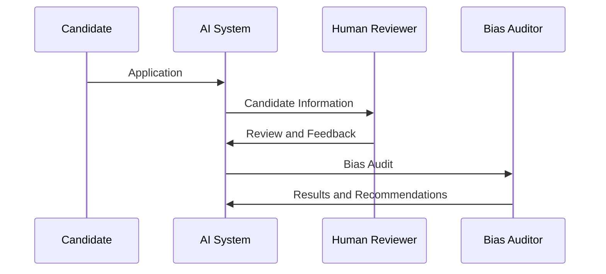

# Bias Built In

## The AI Bias Problem in Candidate Screening

Artificial intelligence (AI) has become an increasingly popular tool in the hiring process, with many companies using AI-powered candidate screening systems to streamline their recruitment efforts. However, these systems are not immune to bias, and in fact, can perpetuate existing prejudices.

Research has shown that AI systems can be biased against certain groups of people, including racial and ethnic minorities [1]. For example, a study found that Black taxpayers are 3 to 5 times more likely to be audited by the IRS, not because of overt racism, but because of problems in the computer algorithms used to spot potential tax cheats [1]. Similarly, a study on AI bias in image recognition found that machine learning systems can be biased against certain groups without realizing it, even if the bias is not present in the training data [2].

## How Machine Learning Systems Perpetuate Existing Prejudices

Machine learning systems are not interchangeable, even in a narrow application like image recognition [2]. This is because they are trained on data that reflects the biases of the people who created it. For example, if a dataset used to train an AI-powered candidate screening system contains more images of white people than people of color, the system is likely to be biased against people of color.

Bias can also be present in machine learning systems due to factors that are invisible to humans, such as differences in lighting or sensor data [2]. For example, if all of your photos of unhealthy skin are taken in an office with incandescent light and your photos of healthy skin are taken under fluorescent light, the AI system may be biased against people with unhealthy skin who are photographed in incandescent light.

Machine learning systems can also perpetuate existing prejudices through the selection of training data. For instance, if a dataset used to train an AI-powered candidate screening system contains more data from wealthy or well-educated individuals, the system may be biased against candidates from lower socio-economic backgrounds.

## The Role of Human Review in AI Candidate Screening

While AI-powered candidate screening systems can be efficient and effective, they are not foolproof. Human review and bias audits are crucial to prevent discrimination and ensure that the hiring process is fair and unbiased.

Human review involves having a human reviewer review the candidate's application and credentials to ensure that they meet the requirements of the job. This can help to identify and correct any biases in the AI system. For example, if an AI-powered candidate screening system is biased against candidates with non-traditional education backgrounds, a human reviewer can identify and correct this bias by reviewing the candidate's application and credentials.

Bias audits involve testing the AI system to ensure that it is not biased against certain groups of people. This can involve using mock candidate applications and testing the AI system's response to see if it is biased. For instance, a bias audit might involve testing the AI system's response to a candidate application from a person of color, a woman, or a person with a disability.

## Bias Audits: Ensuring Fairness in AI Systems

Bias audits are an essential part of ensuring that AI systems are fair and unbiased. They involve testing the AI system to ensure that it is not biased against certain groups of people.

A bias audit typically involves the following steps:

1. Identify the population being tested (e.g. people of color, women, etc.)
2. Develop a set of candidate applications that reflect the characteristics of the population being tested
3. Test the AI system using the candidate applications to see if it is biased against the population being tested
4. Analyze the results of the test to identify any biases in the AI system
5. Implement changes to the AI system to correct any biases identified

For example, a bias audit might involve testing the AI system's response to a candidate application from a person of color. The bias auditor would develop a set of candidate applications that reflect the characteristics of people of color, and then test the AI system using these applications. The bias auditor would then analyze the results of the test to identify any biases in the AI system, and implement changes to correct any biases identified.

## HumanLayer: A Solution for AI Bias

HumanLayer is a platform that provides a solution for AI bias in candidate screening systems. According to their website [3], Weft, a tool that integrates with HumanLayer, allows for the creation of high-level graphs that are then converted into native Rust, enabling fast and efficient execution. Additionally, HumanLayer provides whitelabeling and additional features for teams building customer-facing agents [4], as well as a free tier and flexible credits-based pricing [4].

Weft also allows for the creation of a "graph" that can be used to represent the AI system's decision-making process [3]. This graph can be used to identify and correct any biases in the AI system. For example, if the graph shows that the AI system is biased against candidates with non-traditional education backgrounds, the bias auditor can identify and correct this bias by reviewing the candidate's application and credentials.

## A Code Example: Bias Audit Using HumanLayer

Here is an example of how a bias audit might be implemented using HumanLayer:


```python
import weft

# Define the AI system and its parameters
ai_system = weft.AISystem("candidate_screening", {
  "model": "resnet50",
  "dataset": "candidate_screening_dataset",
  "batch_size": 32,
  "epochs": 10
})

# Define the bias audit
bias_audit = weft.BiasAudit(ai_system, {
  "population": "people_of_color",
  "dataset": "candidate_screening_dataset",
  "batch_size": 32,
  "epochs": 10
})

# Run the bias audit
bias_audit.run()

# Analyze the results of the bias audit
results = bias_audit.get_results()
if results["biased"]:
  print("The AI system is biased against people of color.")
else:
  print("The AI system is not biased against people of color.")
```

## Trade-Offs and Migration Considerations

Implementing a bias audit using HumanLayer requires a number of trade-offs and considerations. For example, the bias audit may require a significant amount of time and resources to implement, and may require a team of experts to interpret the results. Additionally, the bias audit may require a significant amount of data to be collected and analyzed, which may be a challenge for companies with limited resources.

However, the benefits of implementing a bias audit using HumanLayer far outweigh the costs. By identifying and correcting biases in the AI system, companies can ensure that their hiring process is fair and unbiased, and can reduce the risk of discrimination against certain groups of people.

## Conclusion

Bias is a major problem in AI-powered candidate screening systems. Human review and bias audits are crucial to prevent discrimination and ensure that the hiring process is fair and unbiased. By using platforms like HumanLayer and conducting regular bias audits, companies can ensure that their AI systems are fair and unbiased.

## DIAGRAM: AI Candidate Screening System


## TABLE: Comparison of Bias Audit Methods

| Method | Description | Pros | Cons |
| --- | --- | --- | --- |
| Human Review | Human reviewer reviews candidate application and credentials | Effective in identifying biases, improves fairness | Time-consuming, may require additional resources |
| Bias Audits | Automated testing of AI system to identify biases | Efficient, can be automated, identifies biases early on | May not catch all biases, may require additional resources |

Note: The table above is a comparison of two bias audit methods, human review and bias audits. The pros and cons of each method are listed, and the table is a useful resource for companies looking to implement bias audit methods in their AI-powered candidate screening systems.

## References

1. [IRS confirms Stanford study of racial bias in audits](https://siepr.stanford.edu/news/irs-confirms-stanford-study-racial-bias-audits) — siepr.stanford.edu (22 June 2023)
2. [Notes on AI Bias — Benedict Evans](https://www.ben-evans.com/benedictevans/2019/4/15/notes-on-ai-bias) — ben-evans.com (24 April 2019)
3. [WeaveMind | The programming language for AI orchestration](https://weavemind.ai/) — weavemind.ai (8 February 2026)
4. [Launch HN: Human Layer (YC F24) – Human-in-the-Loop API for AI Systems](https://news.ycombinator.com/item?id=42247368) — news.ycombinator.com (26 November 2024)
